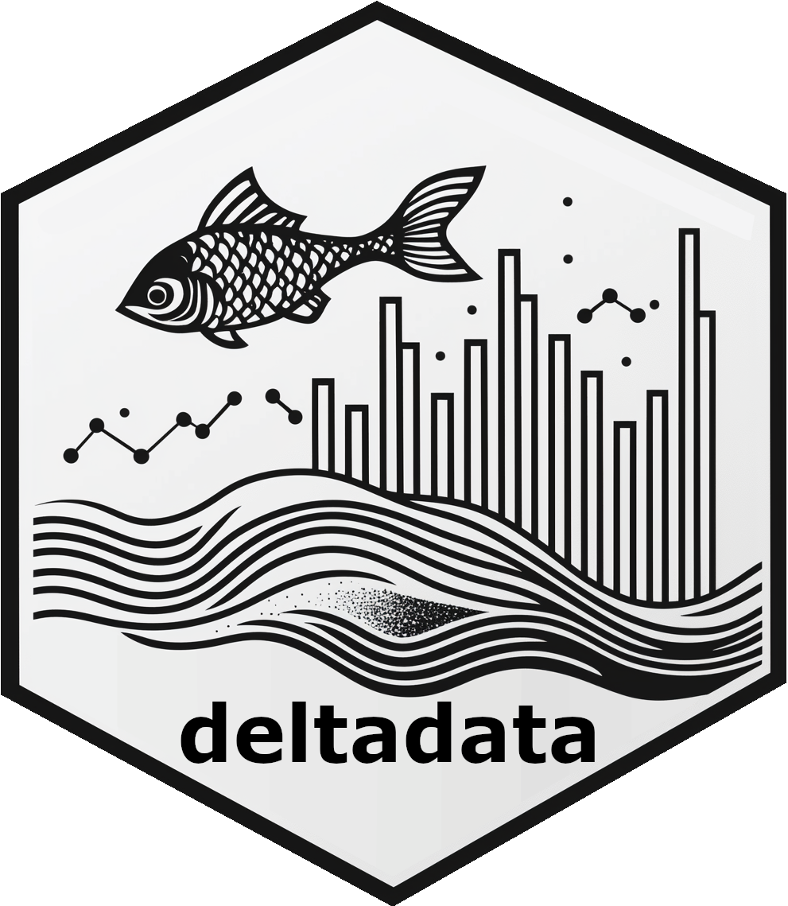

# deltadata <a href="https://github.com/trinhxuann/deltadata/"></a>

This package contains various workflow functions for working with data
within the Sacramento-San Joaquin River Delta. There is a primary focus
on IEP (Interagency Ecological Program) Surveys and supporting their
data publication workflows. Additional features pertaining to other IEP
surveys may be supported in the future.

The main use cases of this package are:

1.  Easily connect to an Access database, extracting and joining its
    relational tables
2.  Quality Assurance and Quality Control workflows, functions to help
    automate and standardize
3.  Downloading data from CDEC (California Data Exchange Center)
4.  Downloading data from EDI (Environmental Data Initiative)
5.  Downloading data from SacPAS

## Installing the package

The `deltadata` package can be installed from its GitHub repository.

``` r
# Install `devtools` if we need to
install.packages("devtools")
# Installing `deltadata` if we do not already have it
devtools::install_github("trinhxuann/deltadata")
```

## Contact

If you have any suggestions or encounter any bugs, please feel free to
open an [issue](https://github.com/trinhxuann/deltadata/issues),
contribute to the package via a pull request, or directly contact [Trinh
Nguyen](mailto:trinh.nguyen@wildlife.ca.gov).
