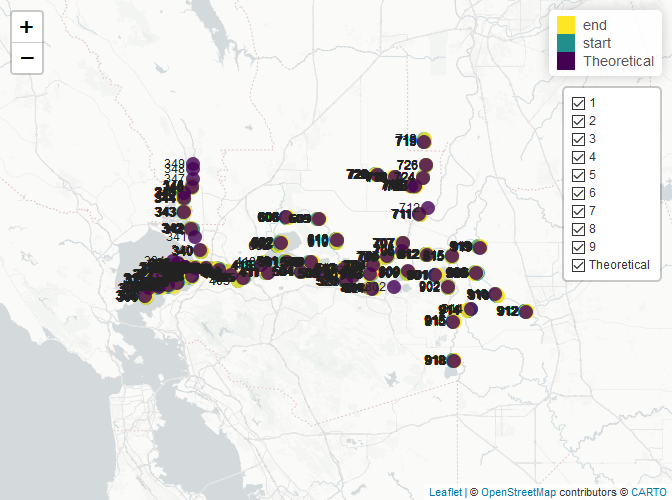
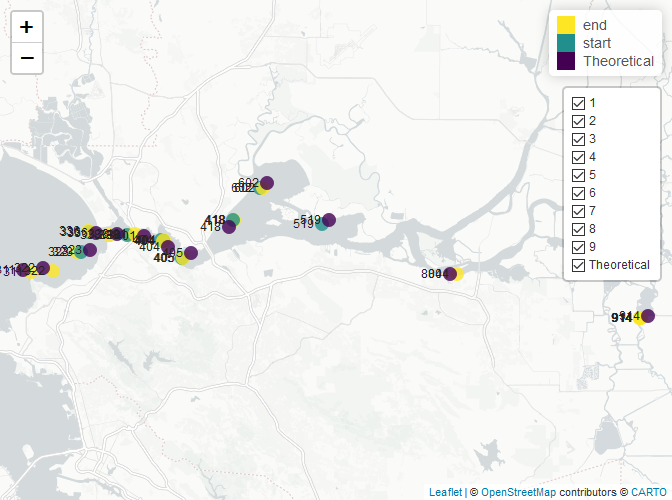

This package contains various workflow functions for working with data
within the Sacramento-San Joaquin River Delta. There is a primary focus
on IEP (Interagency Ecological Program) Surveys and supporting their
data publication workflows. Additional features pertaining to other
surveys may be supported in the future.

The following is a case study using tools in this package to help QAQC
the 20 mm Survey Access database, a yearly process that precedes data
publication.

``` r
library(deltadata)
```

## Installing the package

The `deltadata` package can be installed from its GitHub repository.

``` r
# Install `devtools` if we need to
install.packages("devtools")

# Installing `deltadata` if we do not already have it
devtools::install_github("trinhxuann/deltadata")
```

## Reading in your data

The `bridgeAccess()` function is our primary tool to download, connect
to, and extract data tables from an Access database. However, there is a
prerequisite that we must fulfill.

#### Prerequisite to enable `bridgeAccess()`

The function requires that the architectures of our R and Microsoft
Access be the same, i.e., 32 vs 64-bit. To help users, the function
automatically checks for this requirement before proceeding. If the
architectures are not the same, an interpretable error will inform the
user. For most state computers, we have 32-bit Microsoft Access
installed. Unfortunately, the newest versions of R only come in 64-bit.
Therefore, you have two potential solutions:

1.  Download 32-bit R to match your 32-bit Office. The latest version of
    R that supports 32-bit is version
    [4.1.3](https://cran.r-project.org/bin/windows/base/old/4.1.3).
    Although this version is older, I have yet to run into any
    compatability issues with packages. Once installed, `bridgeAccess()`
    will simply use this extra instance in the background, allowing you
    stay working in 64-bit R–you should never have to open or use the
    32-bit R yourself.
2.  Install 64-bit Office. This likely requires installation by your IT
    department. The entire Microsoft Office will need to be installed,
    as I don’t think you can just install 64-bit Access. This solution
    is more future proof and does not require a separate install of R.

We can replicate the architecture check using an internal function of
the package:

``` r
# This function is ran internally in bridgeAccess()
deltadata:::architectureCheck()
#> $check
#> [1] FALSE
#> 
#> $rBit
#> [1] "x64"
#> 
#> $officeBit
#> [1] "x32"
```

The function determines that my architectures do not align, that I am in
64-bit R but have 32 bit Office. This does not automatically throw an
error. The function will attempt to find and use my 32-bit R to
proceed–an error is only thrown if I do not have 32-bit installed.

#### Connecting to your Access database

The first argument of `bridgeAccess()` is the path to your file. This
argument is flexible and can take a filepath to the file on your hard
drive or a URL to a file online. The file must be an Access database or
a compressed file (e.g., .zip) with the Access database inside. If the
Access database needs to be downloaded from a URL or extracted from a
compressed file, the file will be downloaded to the temporary folder (it
will be deleted after R is shut down).

We will download the 20 mm from the FTP website, opting for the .zip
version. The function will download the file, extract it, and provide us
with a list of table names to choose from. If you rerun the function and
the file has already been downloaded, the function will skip downloading
the file again.

``` r
bridgeAccess("https://filelib.wildlife.ca.gov/Public/Delta%20Smelt/20mm_New.zip")
#> Extracting file: '20mm_New.accdb' from the zip file.
```

#### Extracting your tables of interest

Once you have connected to your Access database, the `table` argument
allows you to specify which tables you would like to read into R. If you
do not know, leave this argument blank and the function will return the
names of the available data tables for you to specify (as shown above).
Once specified, all tables will be read into R in a list format.

The 20 mm has five main relational tables needed for QAQC. We can
specify them here:

``` r
relationalTables <- bridgeAccess(file = "https://filelib.wildlife.ca.gov/Public/Delta%20Smelt/20mm_New.zip",
                          tables = c("Station", "Survey", "Tow", "Gear", "20mmStations"))
```

We can also download the system relationship table. This is an important
table that records the relationships between the relational tables in
the database. We can leverage this table to automatically and reliably
join the relational tables with one another. However, this table does
require special permissions to download and may break your database if
you modify it. Although this is very hard to do, I recommend you always
work from a copy of your database and to work only through R.

This table is named `MSysRelationships`. Once fed into `bridgeAccess()`,
the Access file will be opened and a message will be provide with
instructions to enable permissions: in the program, “Enable content,
`Ctrl + g`, enter
`CurrentProject.Connection.Execute "GRANT SELECT ON MSysRelationships TO Admin;"`,
`Enter`, exit file, and rerun this code.”

``` r
schema <- bridgeAccess(
  "https://filelib.wildlife.ca.gov/Public/Delta%20Smelt/20mm_New.zip",
  tables = c("MSysRelationships"), 
  retry = T # The retry argument will rerun the function again after 25 seconds
  )

# The function outputs a list, of which we can index to grab just the table
schema <- schema[[1]]
```

## Data joining

The relational tables must be tied together before we can properly QAQC
the data. To do this, we can use the `schemaJoin()` function to decipher
the relationship table we downloaded above and join the tables. Although
we can join the tables by hand, I prefer using `schemaJoin()` as it
relies entirely on the outlined relationships in the database, allowing
us a way to consistently join the tables correctly (assuming the
database is set up correctly in the first place!).

``` r
joinedData <- schemaJoin(schema, relationalTables)
#> inner_join 'Survey' with 'Station' via columns 'SurveyID' and 'SurveyID' 
#> inner_join 'Station' with 'Tow' via columns 'StationID' and 'StationID' 
#> inner_join 'Tow' with 'Gear' via columns 'TowID' and 'TowID'
```

Throughout the joining process, the function provides a narration of the
join type, the tables being joined, and the column keys the join is
occurring on. We can use this narration to ensure that we are getting
the joins we are expecting. Once our relational tables are joined, we
can proceed with QAQC-ing the dataset.

## Data QAQC

The package supports various QAQC operations that have been duplicated
from or requested by the CDFW IEP surveys. I would like to incorporate
operations from other surveys as well as part of a larger effort to
create a more robust and standardized QAQC workflow that all IEP surveys
can leverage.

#### Checking outlying GPS coordinates

There are two functions dedicated to visualizing and detecting GPS
coordinates that are too far from the desired sampling location:

1.  `plotGPS()`: plots GPS coordinates on a leaflet map. Requires a data
    frame with 6 columns, `date`, `station`, `legend`, `layer`, `lat`,
    and `lon.` The `legend` column should contain the legend labels for
    the plotted points, and it is recommended that one group be the
    “Theoretical” coordinates of each sampling station. The `layer`
    column is used in the layer control (toggling the display of a
    layer) and is generally the survey number. See `?plotGPS()` for more
    information.
2.  `gpsOutlier()`: returns a data frame of GPS coordinates that are
    beyond a specified distance (default is 0.5 mile, measured
    “as-the-crow-flies”, or the most direct path) from each sampling
    location’s theoretical coordinates. This function similarly requires
    a data frame with 6 columns, the same as `plotGPS()`, with a firm
    requirement for a `Theoretical` (named as so) group of GPS
    coordinates in the `legend` column.

A recommended workflow is to find outlying data points with
`gpsOutlier()` then visualize those points with with `plotGPS()`.

Below, we explore the 20 mm 2023 sampling season for outlying sampling
points. For CDFW surveys, sampling points 0.5 miles away from the
theoretical sampling point are deemed potentially outlying.

``` r
filteredData <- joinedData

# Filter for 2023 season
filteredData$SeasonYear <- as.numeric(format(filteredData$SampleDate, format = "%Y")) + 
  (as.numeric(format(filteredData$SampleDate, format = "%m")) > 11)
filteredData <- subset(filteredData, SeasonYear == 2023)

# Add in lat and lon of the sampling locations
filteredData <- transform(filteredData, 
                          startLatitude = decimalDegrees(paste(StartLatDeg, StartLatMin, StartLatSec), "dms"),
                          startLongitude = decimalDegrees(paste(StartLonDeg, StartLonMin, StartLonSec), "dms", isLongitude = T),
                          endLatitude = decimalDegrees(paste(EndLatDeg, EndLatMin, EndLatSec), "dms"),
                          endLongitude = decimalDegrees(paste(EndLonDeg, EndLonMin, EndLonSec), "dms", isLongitude = T))

# Fix the table with the theoretical sampling points. Convert to lat/lon in decimal degrees
officialGPS <- data.frame(
  station = relationalTables$`20mmStations`$Station,
  lat = decimalDegrees(paste(
    relationalTables$`20mmStations`$LatD,
    relationalTables$`20mmStations`$LatM,
    relationalTables$`20mmStations`$LatS
  ), type = "dms"),
  lon = decimalDegrees(paste(
    relationalTables$`20mmStations`$LonD,
    relationalTables$`20mmStations`$LonM,
    relationalTables$`20mmStations`$LonS
  ), type = "dms", isLongitude = T),
  date = NA,
  legend = "Theoretical",
  layer = "Theoretical"
)

# Stack to long format
gpsDF <- data.frame(
  # R recycles rows as long as the vectors are multiples of each other
  date = filteredData$SampleDate,
  station = filteredData$Station,
  legend = rep(c("start", "end"), each = nrow(filteredData)),
  layer = filteredData$Survey,
  lat = c(filteredData$startLatitude, filteredData$end_latitude),
  lon = c(filteredData$startLongitude, filteredData$endLongitude)
)
# Removing duplicates, e.g., multiple fish catches per tow
gpsDF <- unique(gpsDF)

# Add in the theoretical as a legend
gpsDF <- rbind(
  gpsDF,
  officialGPS
)

# Plot it
plotGPS(gpsDF, layerName = "Survey", dateName = "Sampling Date", height = 500)
```

<!-- -->

This interactive (disabled for the README) plot allows us to visualize
all sampling points of interest at once. This is most helpful for
identifying significantly outlying points, e.g., outside of the Delta.
We can click on any point of interest and a pop-up will appear with
layer (here, the survey) and sampling date information. Although this
step is useful for a quick glance at our points, we can do a specific
search for only potentially outlying points using `gpsOutlier()` and
then feeding those points into `plotGPS()`.

``` r
# By default, d = 0.5
gpsOutliers <- gpsOutlier(gpsDF)

plotGPS(gpsOutliers, height = 500)
```

<!-- -->

This creates a much cleaner map. The resulting data frame also contains
the distance from the theoretical sampling point, in case your distance
is not a strict threshold.

``` r
head(gpsOutliers)
#>            date station legend layer      lat       lon lonTheoretical
#> 2970 2023-03-28     323    end     2 38.04039 -122.3035      -122.2863
#> 2894 2023-03-30     338    end     2 38.05886 -122.2320      -122.2489
#> 1153 2023-05-09     405  start     5 38.03381 -122.1600      -122.1467
#> 3955 2023-06-07     322    end     7 38.01992 -122.3362      -122.3508
#> 3236 2023-05-09     405    end     5 38.03381 -122.1587      -122.1467
#> 811  2023-03-30     338  start     2 38.05886 -122.2356      -122.2489
#>      latTheoretical  distance outlier
#> 2970       38.04289 0.9521133    TRUE
#> 2894       38.06003 0.9260127    TRUE
#> 1153       38.03992 0.8366965    TRUE
#> 3955       38.02364 0.8346230    TRUE
#> 3236       38.03992 0.7760053    TRUE
#> 811        38.06003 0.7330460    TRUE
```

#### Comparing water quality values to CDEC gages

Many IEP surveys collect water quality data in addition to fish data.
One way to QAQC this water quality data is to compare to nearby
continuous sondes. We can do this with the `popCDEC()` function. This
function will fetch surface (default) or bottom water temperature,
turbidity, or electro-conductivity data from the nearest CDEC
(California Data Exchange Center) station.

``` r
# For the 20 mm, water quality is taken at the beginning of the first tow (out of 3)
temperatureData <- data.frame(
  time = as.POSIXct(paste(filteredData$SampleDate, 
                              format(filteredData$TowTime, "%H:%M:%S")), 
                        format = "%Y-%m-%d %H:%M:%S",
                        tz = "America/Los_Angeles"),
  station = filteredData$Station,
  lat = filteredData$startLatitude,
  lon = filteredData$startLongitude,
  temp = filteredData$Temp
)
temperatureData <- temperatureData[!duplicated(temperatureData[, c("station", "lat", "lon", "temp")]), ]
# Remove NAs
temperatureData <- na.omit(temperatureData)

# Now, we can populate the data frame with the required data. Depending on how large our data frame is, this can take several minutes.
temperatureOutlierCdec <- popCDEC(temperatureData, variable = "temp")
#> Reading from: https://cdec.water.ca.gov/dynamicapp/req/CSVDataServlet?Stations=OSJ,BIR,FCT,BET,HOL,PRI,TRN,RRI,BAC,LPS,DWS,LIB,TOE,HWB,TMS,MIR,UCS,C24,PCT,C31,PTS,ANH,BDL,NSL,VOL,GZL,OH4,FRK,TWI,SOI,HON,MAL,FLT,SJJ,MRZ,MOK,WCI,BLL,IBS,M13&SensorNums=25&dur_code=E&Start=2023-03-13&End=2023-07-08 
#> Reading from: https://cdec.water.ca.gov/dynamicapp/req/CSVDataServlet?Stations=JER,STI,BKS,EMM,ANC,CPP,CLL&SensorNums=25&dur_code=H&Start=2023-03-13&End=2023-07-06

head(temperatureOutlierCdec)
#>                    time station      lat       lon temp cdecStation tempCDEC
#> 24  2023-03-15 09:34:00     815 38.08392 -121.5714 11.0         OSJ 11.50000
#> 9   2023-03-13 13:05:00     914 37.97153 -121.5209 12.1         BIR 11.77778
#> 420 2023-03-13 08:45:00     809 38.05289 -121.6926 10.5         JER 10.55556
#> 26  2023-03-15 10:30:00     812 38.09003 -121.6395 11.0         FCT 11.22222
#> 2   2023-03-13 09:43:00     901 38.04700 -121.6198 11.1         BET 11.55556
#> 4   2023-03-13 10:35:00     902 38.02303 -121.5831 11.7         HOL 11.61111
#>     timeDifference  distance sensorNumber         sensorDescription units
#> 24               4 0.9729511           25 TEMPERATURE, WATER, DEG F DEG C
#> 9                5 2.0880878           25 TEMPERATURE, WATER, DEG F DEG C
#> 420             15 0.2063425           25 TEMPERATURE, WATER, DEG F DEG C
#> 26               0 1.6144262           25 TEMPERATURE, WATER, DEG F DEG C
#> 2                2 0.7900384           25 TEMPERATURE, WATER, DEG F DEG C
#> 4                5 0.4620903           25 TEMPERATURE, WATER, DEG F DEG C
#>     duration         dataAvailable
#> 24     event 05/19/2006 to present
#> 9      event 03/02/2018 to present
#> 420   hourly 02/25/1999 to present
#> 26     event 04/20/2015 to present
#> 2      event 03/29/2006 to present
#> 4      event 06/26/2006 to present
```

The function returns the desired water quality data from the nearest
CDEC station for each sampling point, in terms of space
(as-the-crow-flies) and time (the closest non-NA value is returned). The
function also reports back various metadata: the nearest CDEC station
(`cdecStation`), the time difference in minutes between the sample of
interest and the CDEC sample (`timeDifference`), the distance in miles
between the sampling point and the CDEC station (`distance`), and other
metadata information about the CDEC station (`sensorNumber`,
`sensorDescription`, `units`, `duration`, `dataAvailable`).

#### All-in-one function

The `qaqcData()` function is an experimental function that attempts to
apply various QAQC operations to an IEP dataset all in one simple
function call. Currently, the function is modeled on the CDFW IEP survey
QAQC procedures. Although the function may work on other IEP surveys, it
has only been tested with the CDFW IEP surveys. The function runs
several QAQC operations on an inputted data set:

1.  outlying GPS points, defaulting to 0.5 mile away from the
    theoretical,
2.  inconsistent cable lengths that are expected based on the sampling
    depth,
3.  outlying flow meter readings that are based on the sampling
    duration,
4.  outlying water quality values (water temperature, Secchi, turbidity,
    electro-conductivity, and salinity) that are two standard deviations
    beyond the mean (per station and per station per month),
5.  and missing data points in the previously mentioned operations.

Each of these operations are optional and are only ran if the supporting
arguments are provided:

1.  gps outliers requires a table of theoretical gps coordinates of each
    station, provided to the `officialGPS` argument,
2.  cable length outliers require a tow schedule, provided to the
    `towSchedule` argument,
3.  flow meter reading outliers require a table of expected ranges,
    provided to the `meterSchedule` argument,
4.  and outlying water quality values require the column to exist in the
    inputted data frame.

The package currently store tow and meter schedules of various CDFW IEP
surveys for ease of use. These are available as `deltadata::towSchedule`
and `deltadata::meterSchedule`. More surveys will be added to the
package as this information becomes available. Users can specify their
own schedules by modeling them against these existing ones.

We can demonstrate this function with the 20 mm database:

``` r
# Create the tow schedule for the 20 mm. This is also available in the package as towSchedule$ttmm
towSchedule <- data.frame(
  duration = c(2.5, 5, 10)[1:7],
  maxDepth = c(10, 13, 17, 21, 26, 32, Inf),
  depth = cut(c(10, 13, 17, 21, 26, 32, Inf),
              breaks = c(0, 10, 13, 17, 21, 26, 32, Inf),
              right = T, include.lowest = T),
  cableLength = c(75, 100, 125, 150, 175, 200, 225)
)

# Create the meter schedule for the 20 mm. This is also available in the package as meterSchedule$ttmm
meterSchedule <- data.frame(
  duration = c(2.5, 5, 10, 5, 10),
  meterMin = c(NA, 5000, 10000, 2500, 5000),
  meterMax = c(NA, 15000, 30000, 15000, 25000),
  gear = c(NA, 2, 2, 1, 1)
)

# The function requires a joined database. We did this earlier using schemaJoin()
# We also must specify a year and survey that is being inputted.
ttmmQAQC <- qaqcData(data = joinedData, year = 2023, survey = "20mm",
                     officialGPS = officialGPS, gpsDistance = 0.5, startingGPSFormat = "dms", # officialGPS was defined previously
                     towSchedule = towSchedule,
                     meterSchedule = meterSchedule)
```

The function returns all results as part of a list, separating the
outlying and the `NA` data points into their own data frames.

``` r
names(ttmmQAQC)
#> [1] "gpsPlot"            "outlierGPS"         "outlierCableLength"
#> [4] "outlierMeterCount"  "outlierDuration"    "waterQuality"      
#> [7] "missingData"

# Outlying water temperature data, per station per month, for 2023
temperatureOutliers <- ttmmQAQC$waterQuality$StationCode_Month$WaterTemperatureTop
head(temperatureOutliers)
#>     Station Month SampleDate Survey             TowTime Temp     mean        sd
#> 130     323     3 2023-03-28      2 1899-12-30 16:20:00  9.0 12.95152 1.4878930
#> 131     323     3 2023-03-28      2 1899-12-30 16:35:00  9.0 12.95152 1.4878930
#> 132     323     3 2023-03-28      2 1899-12-30 16:00:00  9.0 12.95152 1.4878930
#> 285     336     5 2023-05-09      5 1899-12-30 08:13:00 15.1 17.04615 0.8875201
#> 287     336     5 2023-05-09      5 1899-12-30 08:40:00 15.1 17.04615 0.8875201
#> 288     336     5 2023-05-09      5 1899-12-30 08:27:00 15.1 17.04615 0.8875201
#>     thresholdValueMin thresholdValueMax outlier Comments.x Comments.y Comments
#> 130          9.975729          15.92730    TRUE       <NA>   YSI lost     <NA>
#> 131          9.975729          15.92730    TRUE       <NA>   YSI lost     <NA>
#> 132          9.975729          15.92730    TRUE       <NA>   YSI lost     <NA>
#> 285         15.271113          18.82119    TRUE       <NA>       <NA>     <NA>
#> 287         15.271113          18.82119    TRUE       <NA>       <NA>     <NA>
#> 288         15.271113          18.82119    TRUE       <NA>       <NA>     <NA>
```

Although the function does not automatically employ the `popCDEC()`
function, users can manipulate the outputted outlier data frames to be
accepted by the function:

``` r
# The function needs at least five columns: "station", "lat", "lon", "time", and our variable, "temp"
# We already have station. We need to create the time column from the date and tow time columns

temperatureOutliers <- data.frame(
  station = temperatureOutliers$Station,
  time = as.POSIXct(paste(
    temperatureOutliers$SampleDate, 
    format(temperatureOutliers$TowTime, format = "%H:%M:%S")),
    format = "%Y-%m-%d %H:%M:%S",
    tz = "America/Los_Angeles"
  ),
  temp = temperatureOutliers$Temp
)

# The lat/lon columns need to be joined into the dataset using the official GPS data frame from earlier
temperatureOutliers <- merge(
  temperatureOutliers,
  officialGPS[c("station", "lat", "lon")],
  by = "station",
  all.x = T
)

# We now have all required columns.
head(popCDEC(temperatureOutliers, variable = "temp"))
#> Reading from: https://cdec.water.ca.gov/dynamicapp/req/CSVDataServlet?Stations=MRZ,FLT,TMS,SOI,LIB,MIR,FCT,TRN,RRI,BIR,BAC,WCI&SensorNums=25&dur_code=E&Start=2023-03-14&End=2023-05-10 
#> Reading from: https://cdec.water.ca.gov/dynamicapp/req/CSVDataServlet?Stations=CPP,EMM&SensorNums=25&dur_code=H&Start=2023-03-30&End=2023-06-09
#>    station                time temp      lat       lon cdecStation tempCDEC
#> 11     323 2023-03-28 16:20:00  9.0 38.04289 -122.2863         MRZ 11.88889
#> 12     323 2023-03-28 16:35:00  9.0 38.04289 -122.2863         MRZ 11.88889
#> 10     323 2023-03-28 16:00:00  9.0 38.04289 -122.2863         MRZ 11.88889
#> 40     336 2023-05-09 08:13:00 15.1 38.06111 -122.2780         MRZ 15.44444
#> 42     336 2023-05-09 08:40:00 15.1 38.06111 -122.2780         MRZ 15.50000
#> 41     336 2023-05-09 08:27:00 15.1 38.06111 -122.2780         MRZ 15.44444
#>    timeDifference distance sensorNumber         sensorDescription units
#> 11              5 8.023662           25 TEMPERATURE, WATER, DEG F DEG C
#> 12              5 8.023662           25 TEMPERATURE, WATER, DEG F DEG C
#> 10              0 8.023662           25 TEMPERATURE, WATER, DEG F DEG C
#> 40              2 7.847695           25 TEMPERATURE, WATER, DEG F DEG C
#> 42              5 7.847695           25 TEMPERATURE, WATER, DEG F DEG C
#> 41              3 7.847695           25 TEMPERATURE, WATER, DEG F DEG C
#>    duration         dataAvailable
#> 11    event 08/21/2008 to present
#> 12    event 08/21/2008 to present
#> 10    event 08/21/2008 to present
#> 40    event 08/21/2008 to present
#> 42    event 08/21/2008 to present
#> 41    event 08/21/2008 to present
# We see here that EMM has a high time difference. This is because the sensor malfunctioned during the period of interest--the function returns the closest available value.
```

## Conclusion

The `deltadata` package is a collection of workflow functions meant to
help users efficiently work with IEP datasets. In this vignette, we
explored how to QAQC the 20 mm database using the `bridgeAccess()`,
`schemaJoin()`, `plotGPS()`, `gpsOutlier()`, `popCDEC()`, and
`qaqcData()` functions. It is the goal of this package to expand these
functions and add others functions to better support IEP surveys and
their QAQC procedures.

If you have any suggestions or encounter any bugs, please feel free to
open an [issue](https://github.com/trinhxuann/deltadata/issues),
contribute to the package via a pull request, or directly contact [Trinh
Nguyen](mailto:trinh.nguyen@wildlife.ca.gov).
